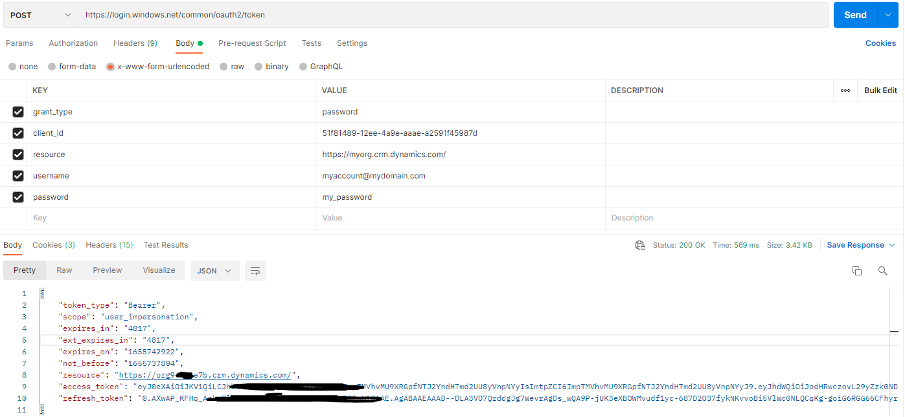
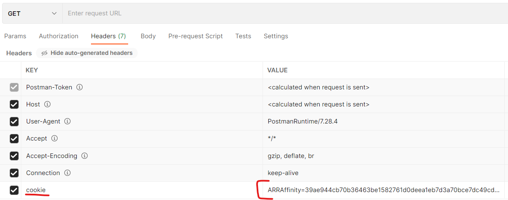

# A 101 Guide to the Dataverse Web API
Dataverse is low-code/no-code friendly data service for storing both structured and unstructured data behind a role-based security model. Dataverse is a pillar of Microsoft's [Power Platform](https://powerplatform.microsoft.com/) and the backbone of Microsoft's [Dynamics 365](https://dynamics.microsoft.com/) first party applications. Dataverse is designed to be as easy-to-use and robust for small workloads while also being scalable and performant enough to handle enterprise workloads on a massive scale.

In addition to being used with it's numerous integrations with other Microsoft and 3rd party products, Dataverse also supports direct interfacing via the [Dataverse Web API](https://docs.microsoft.com/en-us/power-apps/developer/data-platform/webapi/query-data-web-api), a [RESTful API](https://en.wikipedia.org/wiki/Representational_state_transfer). **This article is intended to get you started with using the Dataverse Web API**. By the end of the article, you will be prepared to start querying the Dataverse API!

## Medium
Since the Dataverse API is web-based, all requests must go through the Hypertext Transfer Protocol (HTTP). This is just a fancy way of saying each request to the API will look similar to a URL, like what you'd see in your browser.

We have to be able to customize components of each HTTP request: URL, request headers, body, etc. Because of this, we will be using [Postman](https://www.postman.com/), a free application for customizing these components of an HTTP request, sending to the API, and receiving the response.

You can download Postman here: [Postman Download](https://www.postman.com/downloads/)

## Authentication
Authentication will likely be the most challenging aspect of this article. There are two ways that I will document how you can authenticate; the first is the "correct" way of doing things, and the second is a faster, easier to understand way.

When calling the Dataverse API, you don't directly provide your credentials (username/password) each time you make a single request. Instead, you authenticate with the API once, an *Access Token* is provided to you, and you then provide this *Access Token* to the API each time you make a request. Keep in mind that this token *does* expire however (usually in 60 minutes from the time it was received), so after the expiration time, you'll have to do it again to get a new token!

### Authenticating via an Access Token Request
One can make an HTTP POST request with the following characteristics to receive an access token:
- HTTP Method: `POST`
- URL: `https://login.windows.net/common/oauth2/token`
- Body: `x-www-form-urlencoded` format with the following values:
    - `grant_type`: `password`
    - `client_id`: `51f81489-12ee-4a9e-aaae-a2591f45987d`
    - `resource`: *(the URL of your Dataverse environment)*
    - `username`: *(your username)*
    - `password`: *(your password)*

After constructing the request as specified above, hit send! If all goes well, you'll receive a response like the following:
```
{
    "token_type": "Bearer",
    "scope": "user_impersonation",
    "expires_in": "4817",
    "ext_expires_in": "4817",
    "expires_on": "1655742922",
    "not_before": "1655737804",
    "resource": "https://org9422ae7b.crm.dynamics.com/",
    "access_token": "eyJ0eXAiOiJKV1QiLCJhbGciOiJSUzI1NiIsIng1dCI6ImpTMVhvMU9XRGpfNTJ2YndHTmd2UU8yVnpNYyIsImtpZCI6ImpTMVhvMU9XRGpfNTJ2YndHTmd2UU8yVnpNYyJ9.eyJhdWQiOiJodHRwczovL29yZzk0NDJhZTdiLmNybS5keW5hbWljcy5jb20vIiwiaXNzIjoiaHR0cHM6Ly9zdHMud2luZG93cy5uZXQvMWU4NWYyM2YtYzBhZi00YmNlLWJiOTYtOTIwMTRkM2MxMzU5LyIsImlhdCI6MTY1NTczNzgwNCwibmJmIjoxNjU1NzM3ODA0LCJleHAiOjE2NTU3NDI5MjIsImFjciI6IjEiLCJhaW8iOiJFMlpnWUFqOCtZZWhjTVZoNXI0NHVZYWNpeFVHRTFOZDJJUnlXUXNxR2RiNVBabmI5Z3NBIiwiYW1yIjpbInB3ZCJdLCJhcHBpZCI6IjUxZjgxNDg5LTEyZWUtNGE5ZS1hYWFlLWEyNTkxZjQ1OTg3ZCIsImFwcGlkYWNyIjoiMCIsImZhbWlseV9uYW1lIjoiQWRtaW5pc3RyYXRvciIsImdpdmVuX25hbWUiOiJTeXN0ZW0iLCJpcGFkZHIiOiI0Ny4yMDIuMTIuMjgiLCJuYW1lIjoiU3lzdGVtIEFkbWluaXN0cmF0b3IiLCJvaWQiOiIzNTAzYzUzMy1kZmI5LTRlNDktYmNhZC00N2VkYzgzYzA2NTUiLCJwdWlkIjoiMTAwMzIwMDEzQzIxQTM5MyIsInJoIjoiMC5BWHdBUF9LRkhxX0F6a3U3bHBJQlRUd1RXUWNBQUFBQUFBQUF3QUFBQUFBQUFBQjhBQUUuIiwic2NwIjoidXNlcl9pbXBlcnNvbmF0aW9uIiwic3ViIjoiQkpPeTdRcFJRYk1TTTVjLS1zZlh5aVEyU2t3ZThqdkdzWHNiR0ZuWXlsWSIsInRpZCI6fjFlODVmMjNmLWMwYWYtNGJjZS1iYjk2LTkyMDE0ZDNjMTM1OSIsInVuaXF1ZV9uYW1lIjoiYWRtaW5ARDM2NURlbW9UUzkwOTE5Ni5vbm1pY3Jvc29mdC5jb20iLCJ1cG4iOiJhZG1pbkBEMzY1RGVtb1RTOTA5MTk2Lm9ubWljcm9zb2Z0LQNvbSIsInV0aSI6Ii1oX1BmdWVySDAydlMzWkRDeEZ6QVEiLCJ2ZXIiOiIxLjAiLCJ3aWRzIjpbIjYyZTkwMzk0LTY5ZjUtNDIzNy05MTkwLTAxMjE3NzE0NWUxMCIsImI3OWZiZjRkLTNlZjktNDY4OS04MTQzLTc2YjE5NGU4NTUwOSJdfQ.B7-xfXv5UwPiYyrmbhpRlEOqOSs7aOranemqzFrAJx3h52D_tB2RjRj4rizuhKQTZ4XtyDcNZYMCmj57G64h2ICFXopm3dfpMmZ_hZ6qHD7zwRrQK2oQHUCpxtuyeT17ssLorFuWxZYfQYMxhjQYqu7WFWRX42IMBYeUqV7zGnnJmtMN1piaeasaSENVlo5IAxVyPfQyWv1roc-IjqNhxBB8Egnl3cez8sFDXY5JwwAcxpBRzHcF3HzLsQYqQ28bloUE44Za4JTR0tGushPl34AKdMblZYmCgysZiMH1Gyw8rYyJD2NeImV6Mo0cNvEnkS5tMzhDfMglHCSq92mjttQ",
    "refresh_token": "0.AXwAP_KFHq_Azku7lpIBTTwTWYkU-FHuEp5Kqq6iWR9FmH18AAE.AgABAAEAAAD--DLA3VO7QrddgJg7WevrAgDs_wQA9P-jUK3eXBOWMvudf1yc-687D2O37fykNKvvoBi5VlWc0NLQCqKg-goiG6RGG66CFhyrBYHBscQN6tybyDbb3m9toQ7boa3gKqwqWYA2jUoQ1JFPr8SH1mebCy5RUPXCeGFrksWe1iFJfr-SFCWLh2wpBSRmiX0yZ02nbsDQNXZdNln7FVEcNvGzbFyzlqi-gIS-9FP6rSx82jcs1GJV2OxUkYIE0Bv6x2oPTtZYU78LuERPyxYQ4AxjQmpvzdWpVqidQ5UptW-QSgIpKq_jUFRUas9YZhJNCPNxN5BIUIVLMKFwxRWT3GA5GunjBK6BeUWRr_nI1wU_6G-A_bzxzbXCq5hZB1SsxrEQQDTaWvN8cjG5PPTSnXI6phmi38c-BI_zV2QxXuejPi4FPzWrSaWoru6R3HR7jBCMb6Amueyqks7Zuipbq3GkH-WWxQe26Y0echvDHm2_MkVaxDulQfesR25PFjvkzvFdOy9emLZFIOCmrNJK54gOnhcbn_kdDWQNEwzkOAtO1c6WK6mRKAkXnfObmTc0QsVkkC7YxY704B35ys-i8cYFJM69MDRcWbRg6M-Z4-cR3GCAsGi9_ZcdMXxnClQ-DefVYuc_dY-pWsH62DT92LF048ho1Nh2i3qhxcUWKGxk8ODukHeUNs5Z3504h7T1ssCwZQa65AERRT9ote2Rgi1U0NlOsz0STV9NGzktZK0iiDzLTtzCuEOw_JSr"
}
```
Altogether, your request and response should look like this:



The `access_token` property (beginning with "eyJ" and ending with "ttQ") is what we're after. We will supply this to all future requests.

We must supply this value as a *Bearer Token*, a specific format for providing an access token via an API. Open a new request in Postman. Go to the *Authorization* tab and change the *Type* dropdown to *Bearer Token*. Paste the value of the `access_token` into the `token` field:


### Using Cookies from your Browser
When you are logged into a part of the Power Platform - say Power Apps, for example, a cookie will be added to your browsing session so you don't have to re-authenticate on *every* page! We are actually able to "intercept" this cookie from the web browser and use this in our requests.

To get this cookie, we first need to know the URL of your dataverse environment. From the Power Platform Admin Center, open your environment. Your will find this URL listed as the **Environment URL**. For example, mine looks like this: https://org56f8d45d.crm.dynamics.com/.

Append `/api/data/v9.0/` to this environment URL, so it looks like this: `https://org56f8d45d.crm.dynamics.com/api/data/v9.0/`. From your authenticated browser session, navigate to this URL. You should receive a list of tables that exist in this environment. 

Open your browser's developer tools (I am using Microsoft Edge) with Ctrl+Shift+I. With the developer tools open, refresh the webpage. You should see a network log labeled `v9.0`. Click on this. In the *headers* tab (opened by default), scroll down to find the `cookie` header. Copy the value of this header; this is what we will be using!


In each request we make via Postman, we must provide this value in the headers, labeled as `cookie`. Open a new request in Postman. Add this value to the headers with the label `cookie`, like below:



## The OData Protocol
The Dataverse API follows the standards described by the [Open Data Protocol ("OData")](https://www.odata.org/). OData is a set of best practices for building and consuming RESTful API's. Breaking this down, this means that the Dataverse API follows a standard that makes querying easy and understandable, with a format of which is almost universally understood. Some of the features of OData include:
- `$filter`: filtering results
- `$select`: selecting only specific fields to be returned
- `$orderby`: sorting the returned results
- `$count`: receiving a count of the queried records
- `$top`: limiting the number of records returned
Each of the parameters above can be passed into the query URL in a read request to the Dataverse API. For more information about OData: [OData queries](https://docs.microsoft.com/en-us/odata/concepts/queryoptions-overview).

## Dataverse Read Operation
Now that we have a request in Postman equipped with the necessary data to authenticate, we can begin making calls! 

### List Tables
Firstly, make a `GET` request (the drop down near the URL in Postman) to the following URL: `https://org9442ae7b.crm.dynamics.com/api/data/v9.0` (obviously replacing `org9442ae7b` with your org name).

If successful, you will receive back a list of tables in your Dataverse instance, in Javascript Object Notation (JSON) format. It will look like this (this is truncated, but you get the point):
```
{
    "@odata.context": "https://org9442ae7b.crm.dynamics.com/api/data/v9.0/$metadata",
    "value": [
        {
            "name": "accounts",
            "kind": "EntitySet",
            "url": "accounts"
        },
        {
            "name": "contacts",
            "kind": "EntitySet",
            "url": "contacts"
        },
        {
            "name": "phonecalls",
            "kind": "EntitySet",
            "url": "phonecalls"
        },
        ...
```
In each object in the `value` property, we can see the name of the table, the type, and the `url` to access the data in the table.

### Read a Table
To get a list of records (data) that exist in each table, simply append one of the `url` properties to the URL that we used above to list the tables. For example, to get contacts: `https://org9442ae7b.crm.dynamics.com/api/data/v9.0/contacts`.

The response will return **every field** of **every record** in the contacts table. To limit the number of responses we get to 5, you can append `$top=5` to the URL as a parameter, like so: `https://org9442ae7b.crm.dynamics.com/api/data/v9.0/contacts?$top=5`.

You just appended an OData parameter to your URL! By stacking the OData parameters mentioned earlier, you can create more complex queries.

### Read a single record
If we know the GUID ("Global Unique Identifier", a primary key) of a single record in a table, you can request data for *only* that record by including it in paranthesis. For example, requesting a single record with ID `8e27ee97-cbe1-ec11-bb3d-00224803b8c6` from the contacts table: `https://org9442ae7b.crm.dynamics.com/api/data/v9.0/contacts(8e27ee97-cbe1-ec11-bb3d-00224803b8c6)`. You will see that the response does not return an *array* of objects, but rather a single object.

## Dataverse Write Operation
In addition to reading from Dataverse, we can also use the Web API for *writing* to Dataverse.

### Create a New Record
Make a new request in Postman. Add the necessary authentication data, as described above in the **Authenticate** section. Set the HTTP method to `POST` and set your target URL to `https://org9442ae7b.crm.dynamics.com/api/data/v9.0/accounts` (obviously replacing `org9442ae7b` with your org name). This means our intention is to **create** a new **account** record.

Navigate to the *Body* column. Select *raw* as the body type, and *JSON* as the format. The Dataverse Web API accepts the data of the record in JSON format. To set the name of the account we would like to save, set the body to the following:
```
{
    "name":"Stark Industries"
}
```
Hit send! If you receive a `204 No Content` response, you have succeeded. Pull up the list of accounts in a model-drvien app and now you should see your new account has been made.


### Update a Record
As per the OData standard, we can only update a single record at a time via the Dataverse Web API. To do this, we *must* know the GUID (primary key) value of the record we wish to update. For example, changing the name of the account record with ID `a33dd8e6-b6f0-ec11-bb3d-000d3a357ea4`:
- Set the HTTP method to `PATCH`
- Set the URL to `https://org9442ae7b.crm.dynamics.com/api/data/v9.0/accounts(a33dd8e6-b6f0-ec11-bb3d-000d3a357ea4)` (obviously replacing `org9442ae7b` with your org name and `a33dd8e6-b6f0-ec11-bb3d-000d3a357ea4` with a GUID of a record in your account table)
- Similar to above, set the *Body* of your request to *raw* and the format to *JSON* with the following content:
```
{
    "name":"Tesla Inc"
}
```
After sending this request, you will again receive a `204 No Content` response if the update was successful. If you make a read call for the accounts table using the methods outlined earlier, you should see your change reflected.

## Delete a Record
So far we've seen how to **create** a record, **read** a record, and **update** a record. Finally, we will explore how you can **delete** a record. Just like with update requests, the OData standard does not allow for deletion of multiple records in a single request. Thus, again, we must know the GUID of the record we would like to delete. For example, deletion of the account record with ID `a33dd8e6-b6f0-ec11-bb3d-000d3a357ea4`:
- Set the HTTP method to `DELETE`
- Set the URL to `https://org9442ae7b.crm.dynamics.com/api/data/v9.0/accounts(a33dd8e6-b6f0-ec11-bb3d-000d3a357ea4)` (obviously replacing `org9442ae7b` with your org name and `a33dd8e6-b6f0-ec11-bb3d-000d3a357ea4` with a GUID of a record in your account table)
    - Note that this is the same URL that we used above for the update. The *only* difference between the update and delete operation is the HTTP method used.

Unlike the update operation, we obviously will not need to provide content in the request Body because this is merely a delete operation - no data should be changed. Be sure you have *none* selected under the *Body* tab.

After specifying the above in your request, press send. If you receive a `204 No Content` response, this means your delete request was successful. The targeted record with the ID that you specified is now deleted.